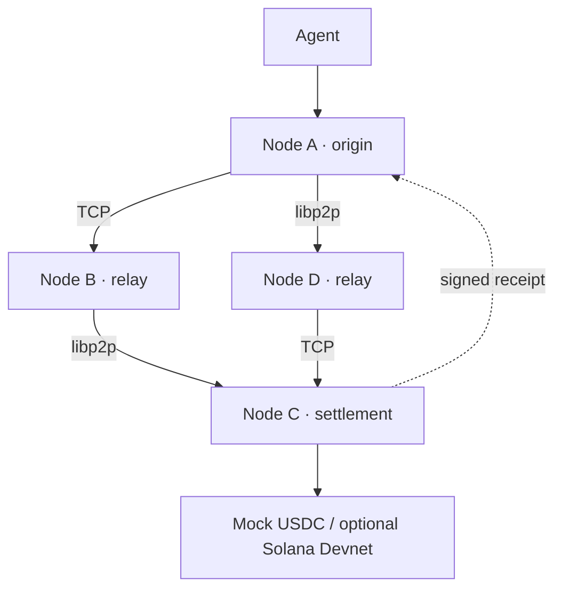

# AIFP-4 Mesh

**A transport-independent payment message layer for AI agents.** The Colosseum MVP runs independent nodes that discover peers, forward signed payment intents over TCP and libp2p, route to a settlement-capable node, and return a verified receipt. Mock USDC is the default rail; SOL settlement requires a separately funded **Solana Devnet-only** payer on node C.

Implementation evidence and external blockers: [status matrix](docs/IMPLEMENTATION_STATUS.md). TCP and libp2p are the tested network links. TCP now fragments oversized envelopes at a configurable frame MTU; tests deliver an actual A→B→C payment at 400-byte TCP MTU and resume incomplete reception after restart. libp2p remains unfragmented. Bluetooth, radio, non-IP satellite, BPv7 and ProSe are not operational. Optional funded Devnet proof: `node scripts/compose-devnet-smoke.mjs` with a disposable pre-funded Devnet payer exported to both the Compose environment and the script environment.

Payment forwarding now uses per-node SQLite bundles and hop records. TCP and libp2p `submit()` accept work locally; the receiving node verifies and durably records the full signed envelope before issuing a separate signed `HOP_ACCEPTED`. ACKs and settlement receipts can return over another route. Retries sign new hop messages while retaining the original payment identity; expired or uncertain settlements remain locked. Peer discovery still uses a synchronous control exchange. Selective fragment retransmission and generic libp2p framing remain future work.

## Run the network

```bash
docker compose up --build -d --wait
```

Open **http://127.0.0.1:4044/**. The dashboard proxies node A. Five independent Mesh processes run: A, B, C, D, and a bootstrap relay. Each has its own Docker volume, Ed25519 identity, libp2p peer ID, peer registry and payment state. A separate dashboard container serves the UI. No external Internet is required for mock settlement on the local Docker network.

```bash
node scripts/compose-smoke.mjs
```

The script proves A → B via TCP, B → C via libp2p, stops B, proves A → D via libp2p, D → C via TCP, then restarts B. It creates only mock USDC payments. See [the manual demo](docs/MESH_DEMO.md). `docker compose down` retains volumes; `docker compose down -v` removes all local identities and demo history.

## What works

| Layer | Current behavior |
| --- | --- |
| Mesh | Ed25519 signed CBOR envelopes, persistent peer identities, signed capability/link advertisements, multi-hop forwarding, replay cache and hop/expiry limits. |
| Transport | Two real software adapters: length-framed TCP and libp2p TCP with Noise/Yamux. Links are transport-specific edges; the same payment payload crosses both. |
| Routing | Weighted shortest path over current signed link advertisements; failed next hop is excluded and an alternative is tried. Settlement rail scoring remains separate. |
| Disruption | Origin and relays persist queued bundles and retry after route recovery. Settlement node persists execution and returns the same receipt for duplicates. An uncertain settlement is locked. |
| Payment | Existing agents, policies, deterministic intent hash, mock rail, offline mode, receipts, API and UI remain. Node C is the only default settlement node. |
| Solana | Optional real Devnet SOL adapter on node C, with `AIFP4:<intentHash>` memo and confirmed transaction signature. No funded Devnet transaction was run as part of the Mesh tests. |

The node-level protocol is a **custom AIFP-4 envelope** with DTN ideas, not a BPv7 or TCPCLv4 implementation. CBOR is used for network encoding; signatures cover canonical JSON fields. COSE, BPSec, Bluetooth, ProSe, LoRa and satellite-specific links are **not implemented**. IP over Wi-Fi/cellular/satellite may carry the existing TCP transport when normal IP connectivity exists; this does not make them native adapters. GNSS is location metadata, never a transport.

## Payment flow



Agent → policy → signed intent → signed Mesh envelope → weighted node/transport route → settlement rail → signed receipt. The node path and transport per hop are stored on the intent and shown in the dashboard. If B is stopped, A tries D; when C disappears, A retains the intent and retries on recovery.

## API example

The local demo key is `sandbox-demo-key`. It is public and suitable only for the localhost mock demo. Use distinct random credentials for any shared sandbox.

```bash
curl -s -X POST http://127.0.0.1:4044/v1/intents \
  -H 'content-type: application/json' -H 'x-aifp4-api-key: sandbox-demo-key' \
  -d '{"idempotencyKey":"demo-unique-001","agentId":"agent_demo","beneficiary":"ai-data-api","amountMinor":250,"asset":"USDC","purpose":"Dataset access"}'
```

Copy the returned `id`, then call `POST /v1/intents/{id}/execute` with the same key. `GET /v1/intents/{id}/path` returns the node path, transport path and receipt verification. Network data is available at `/v1/mesh/node`, `/peers`, `/links`, `/routes`, `/topology`, `/transports`, `/queue` and `/messages`. See [OpenAPI](openapi/aifp4-mesh.yaml).

## Solana Devnet

Only `mesh-node-c` receives `SOLANA_PAYER_SECRET_JSON` from a local **untracked** `.env`. Use a disposable, pre-funded Devnet wallet only. Set separate `AIFP4_API_KEY` and `MESH_HMAC_SECRET` values (at least 32 characters, e.g. `openssl rand -hex 32`); startup rejects demo credentials when a payer is present. Enter the API key in the dashboard. SOL amounts are lamports and the recipient must be a valid Devnet address. A real Explorer link is returned only after the adapter confirms a real transaction. No mainnet mode is provided. See [Solana instructions](docs/DEPLOYMENT.md).

## Security and boundaries

Nodes authenticate signed messages and verify the origin's signed intent and policy payload separately from transport security. The TCP adapter is plaintext on the isolated Compose network. Initial peer discovery uses configured addresses and trust on first use for keys; secure enrollment/key pinning and distributed consensus are future work. The JSON store is single-process per node. This is software orchestration, not a licensed bank or payment institution; production fiat/card execution requires appropriate providers and legal review. See [SECURITY.md](SECURITY.md) and [threat model](docs/THREAT_MODEL.md).

## Development

```bash
npm ci
npm run ci
npm audit --omit=dev --audit-level=high
```

The tests spawn four independent child processes on loopback. CI additionally builds Compose, waits for health, and runs the Docker failure demo. Legacy x405 work remains in `legacy/` for disclosure and is not the Mesh product positioning.

Docs: [architecture](docs/ARCHITECTURE.md) · [protocol](docs/MESH_PROTOCOL.md) · [routing](docs/MESH_ROUTING.md) · [DTN](docs/DTN_ARCHITECTURE.md) · [transport SDK](docs/TRANSPORT_ADAPTER_SDK.md) · [standards](docs/STANDARDS.md) · [roadmap](docs/ROADMAP.md). No license has been granted in this repository.
