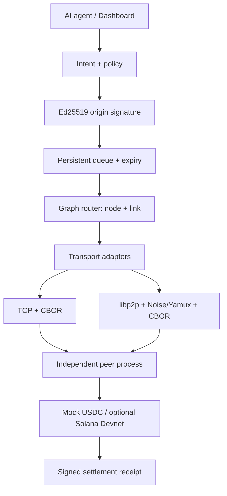

# Architecture

Each Compose Mesh service is an independent Node.js process with separate Ed25519 and libp2p identities, payment JSON store, signed advertisement registry, replay store and events. Node A serves the dashboard API through an Nginx proxy; C alone has the default mock settlement adapter and is the only node that can receive an optional Devnet payer. Bootstrap is a high-cost relay, not a centralized payment coordinator.

The route planner sees signed capability and link advertisements. It chooses a settlement node with the requested asset, then a weighted directed path whose edges specify the transport. Each hop checks the previous hop signature; every relay also checks the unchanged origin intent hash, signature, policy snapshot and expiry. C executes with the existing rail adapter. The signed receipt travels back over the request/response chain and is verified and persisted by A. Lost responses can be retried through another route; C's persistent intent and receipt records prevent another settlement. An uncertain rail outcome stays locked.

The implementation is a single-host Docker network demo, with loopback process tests. It does not require Internet for the mock rail. Solana Devnet requires connectivity to the public RPC. The storage is per node, never a shared volume. See [routing](MESH_ROUTING.md), [failure recovery](FAILURE_RECOVERY.md) and [threat model](THREAT_MODEL.md).
