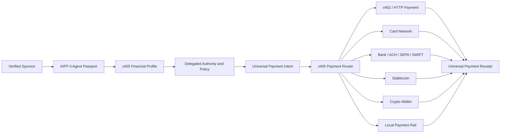

# x405 — Universal Payment Protocol for AI Agents

**AiFinPay AIFP-4 / x405 · Draft Standard v0.2**

> Give an AI agent a persistent financial profile, delegated authority, programmable spending rules, and access to multiple payment rails through one interoperable protocol.

x405 is a proposed open standard for the agent economy. It defines how an AI agent receives financial capability from a verified human or organization and then pays through the best permitted rail: x402, payment card, bank transfer, stablecoin, crypto wallet, or a local payment network.

**AIFP-4 is the AiFinPay protocol layer that specifies x405.**

---

## The protocol in one sentence

```text
Verified Sponsor → Agent Passport → Financial Profile → Delegated Authority → Payment Credentials → Universal Router → Payment Rail → Verifiable Receipt
```

The agent does not need to know whether the final settlement uses a card, bank rail, stablecoin, wallet, or x402-compatible flow. The agent expresses a payment intent; x405 determines what the agent is allowed to do and which eligible rail can execute it.

---

## Why x405 exists

AI agents can already call APIs, negotiate services, purchase infrastructure, and execute workflows. Their financial access is still fragmented across wallets, cards, bank portals, custodial accounts, API-specific payment methods, and human approvals.

x405 standardizes the missing **financial capability layer**:

- who is legally or operationally sponsoring the agent;
- which identity is bound to that agent;
- which regulated onboarding has been completed;
- which wallets, cards, accounts, or payment handles are available;
- what the agent is authorized to spend;
- where, when, why, and how much it may pay;
- which rail should be selected;
- how execution is evidenced and reconciled;
- how authority can be suspended or revoked.

The target developer experience is intentionally simple:

```ts
await x405.pay({
  amount: "37.50",
  currency: "USD",
  merchant: "merchant_or_endpoint_ref",
  purpose: "software",
  mode: "AUTO"
});
```

The protocol handles identity, authority, policy, credential eligibility, route selection, execution, and receipt generation behind that intent.

---

## x405 and x402

x402 is an open standard for internet-native payment negotiation over HTTP and is now stewarded through the Linux Foundation x402 Foundation. It can support multiple payment schemes, including cards and stablecoins.

x405 is complementary. It standardizes the **agent-side financial capability and delegation model**.

| Layer | Primary question |
|---|---|
| **x402** | How does a client and server negotiate and complete a payment over HTTP? |
| **x405 / AIFP-4** | Which financial identity, authority, credential, funding source, and payment rail may this AI agent use? |

An x405 implementation MAY select x402 as one of its execution rails or negotiation mechanisms.

### Naming note

`x405` is the protocol name. It does **not** redefine or depend on the HTTP `405 Method Not Allowed` status code.

---

## Identity and onboarding model

The verified party is the **Sponsor**: a human, developer, company, platform, or other organization that has authority to create or operate an agent.

```text
Human / Company / Agent Platform
          ↓
KYC / KYB onboarding with regulated provider
          ↓
Compliance attestation / provider reference
          ↓
AIFP-3 Agent Passport
          ↓
x405 Agent Financial Profile
          ↓
Delegated Authority + Payment Credentials
          ↓
Autonomous payments within policy
```

Initial KYC/KYB onboarding can be performed once for the relevant relationship, but x405 does not assume AML or sanctions obligations end after onboarding. Licensed providers may require continuous transaction monitoring, sanctions screening, re-verification, or re-KYC/KYB.

Raw KYC documents and unnecessary regulated personal data SHOULD remain with the regulated provider. x405 SHOULD use tokenized references and signed attestations.

---

## Agent Financial Profile

Every x405-enabled agent can be bound to an `AgentFinancialProfile`.

The profile contains references to:

- AIFP-3 Agent Passport;
- verified Sponsor or organization;
- regulated-provider onboarding status;
- delegated authority;
- funding sources;
- payment credentials;
- allowed rails;
- spending and velocity limits;
- merchant, MCC, country, currency, asset, and purpose policies;
- approval requirements;
- lifecycle state and revocation state.

A profile does not make an AI agent a legal person. It represents financial authority delegated by a verified person or organization under applicable provider and jurisdiction rules.

---

## Universal payment credentials

x405 treats payment access as tokenized credentials rather than exposing raw financial secrets to the agent.

Supported credential classes can include:

- `CARD_TOKEN` — tokenized virtual or physical card credential;
- `BANK_ACCOUNT_TOKEN` — provider handle for bank-account or transfer capability;
- `CRYPTO_WALLET` — wallet controlled under approved key policy;
- `STABLECOIN_ACCOUNT` — stablecoin settlement capability;
- `X402_WALLET` — credential usable for x402-compatible payments;
- `LOCAL_RAIL_TOKEN` — provider-specific local payment capability.

Agents SHOULD NOT receive raw PAN/CVV, banking passwords, private KYC files, or unrestricted provider credentials.

---

## Universal routing

Text fallback (always readable):

```text
Verified Sponsor
  → AIFP-3 Agent Passport
  → x405 Financial Profile
  → Delegated Authority and Policy
  → Universal Payment Intent
  → x405 Payment Router
      ↳ x402 / HTTP payment
      ↳ Card network
      ↳ Bank / ACH / SEPA / SWIFT
      ↳ Stablecoin
      ↳ Crypto wallet
      ↳ Local payment rail
  → Universal Payment Receipt
```

Interactive diagram:



Route selection can consider:

- agent authority;
- merchant acceptance;
- amount and currency;
- sponsor policy;
- credential availability;
- jurisdiction;
- compliance status;
- cost and FX;
- latency and reliability;
- reversibility;
- settlement finality;
- provider health.

---

## Trust boundaries

| x405 / AIFP-4 | Regulated provider / issuer / bank / PSP |
|---|---|
| Agent financial profile and protocol messages | Regulated onboarding where required |
| AIFP-3 identity binding | KYC/KYB and beneficial-owner verification where applicable |
| Delegated authority and policy | AML, sanctions, transaction monitoring and reporting as assigned by applicable law and definitive agreement |
| Universal payment intent | Card issuance, account issuance, money transmission or safeguarding where licensed |
| Credential references and routing | Actual regulated execution |
| Signed receipts and reconciliation | Chargebacks, returns, disputes and regulated complaints where applicable |

AiFinPay does not become a bank, card issuer, custodian, money transmitter, or payment institution merely by defining or operating x405 software infrastructure. Regulatory classification depends on the actual activities performed, jurisdiction, contracts, and applicable law.

See the vendor-neutral [`Compliance/`](Compliance/) framework. It is designed so any eligible licensed provider can integrate with x405 without being named in the core standard.

---

## Core security rules

- Deny by default.
- Every agent is bound to a sponsor and AIFP-3 identity.
- Every payment is bound to an immutable intent.
- Credentials are scoped, tokenized, revocable, and least-privilege.
- Card PAN/CVV and provider master credentials are not exposed to the agent.
- Nonce, expiry, canonical hashing, idempotency, and replay protection are mandatory for signed flows.
- High-risk payments can require human or M-of-N approval.
- Merchant, MCC, beneficiary, country, currency, rail, and purpose controls are enforceable.
- Financial profiles, credentials, agents, merchants, and rails can be frozen independently.
- Every completed execution can produce a verifiable receipt.

See [Security Model](docs/security-model.md) and [Compliance Boundaries](docs/compliance-boundaries.md).

---

## Protocol objects

| Object | Purpose |
|---|---|
| `AgentFinancialProfile` | Persistent financial identity and capability container for an agent. |
| `ComplianceAttestation` | Tokenized reference to onboarding/compliance state from an eligible provider. |
| `DelegatedAuthority` | Machine-readable limits and permissions granted by the Sponsor. |
| `PaymentCredential` | Tokenized handle for a card, bank, wallet, stablecoin, x402, or local payment capability. |
| `UniversalPaymentIntent` | Rail-independent instruction describing what the agent wants to pay. |
| `RouteQuote` | Eligible execution route with fees, FX, timing, and conditions. |
| `SettlementInstruction` | Signed instruction sent to the selected provider or rail adapter. |
| `UniversalPaymentReceipt` | Verifiable record of intent, authority, route, execution, and final status. |

---

## Conformance profiles

A vendor can implement one or more profiles:

- **x405-Core** — financial profile, authority, intent, routing, receipt semantics;
- **x405-Agent** — agent-side client and credential handling;
- **x405-Provider** — regulated-provider adapter and capability manifest;
- **x405-Card** — tokenized card issuing and card-payment profile;
- **x405-Bank** — bank-transfer and account-payment profile;
- **x405-x402** — interoperability profile for x402-compatible payments;
- **x405-DigitalAsset** — wallet and stablecoin execution profile.

Conformance requires published test vectors, deterministic state transitions, replay protection, and receipt verification.

---

## Developer surface

| Surface | Location |
|---|---|
| Documentation portal | [`docs/index.md`](docs/index.md) |
| x405 standard overview | [`docs/x405-standard.md`](docs/x405-standard.md) |
| Core normative specification | [`docs/aifp4/01-core-specification.md`](docs/aifp4/01-core-specification.md) |
| Architecture | [`docs/architecture.md`](docs/architecture.md) |
| Onboarding & delegation | [`docs/onboarding-and-delegation.md`](docs/onboarding-and-delegation.md) |
| **Global compliance framework** | [`Compliance/README.md`](Compliance/README.md) |
| Compliance boundaries | [`docs/compliance-boundaries.md`](docs/compliance-boundaries.md) |
| Security model | [`docs/security-model.md`](docs/security-model.md) |
| OpenAPI 3.1 draft | [`openapi/aifp-4.openapi.yaml`](openapi/aifp-4.openapi.yaml) |
| JSON Schemas | [`schemas/`](schemas/) |
| TypeScript reference types | [`src/types.ts`](src/types.ts) |
| Roadmap | [`ROADMAP.md`](ROADMAP.md) |

The existing v0.1 reference orchestrator remains available as a treasury/corporate profile while v0.2 x405 interfaces are introduced additively.

---

## Protocol family

| Protocol | Role |
|---|---|
| **AIFP-1** | Merchant monetization of AI-agent traffic and paid digital resources. |
| **AIFP-2** | x402-compatible agent payment flows. |
| **AIFP-3** | Agent Passport: identity, ownership/organization binding, and authority roots. |
| **AIFP-4 / x405** | Universal financial capability and multi-rail payment standard for AI agents. |
| **AIFP-5** | Quantum-safe financial security profile. |
| **AIFP-6** | Agentic financial governance and policy controls. |

---

## Status

**Version:** 0.2-draft  
**Status:** Proposed open standard / implementation draft  
**Production status:** Not production-ready by specification alone

The term “standard” in this repository describes the intended interoperable specification. It does not claim formal adoption by an international standards body or universal market adoption.

References:

- x402: https://x402.org/
- Linux Foundation x402 Foundation: https://www.linuxfoundation.org/press/linux-foundation-announces-operational-launch-of-x402-foundation-to-standardize-internet-native-payments-for-ai-agents-and-applications
- HTTP Semantics / 405: https://www.rfc-editor.org/rfc/rfc9110
