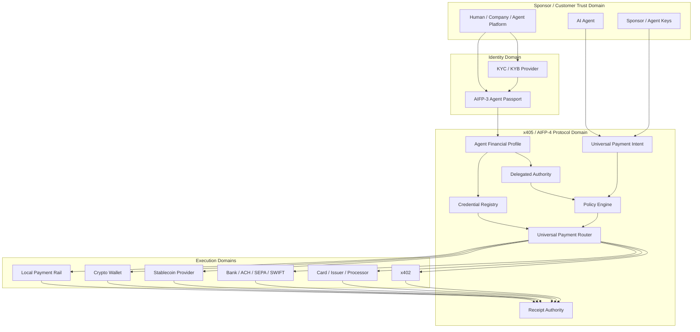

# x405 / AIFP-4 Architecture

## 1. Design objective

x405 is a universal financial capability layer for AI agents. It separates **who the Agent is and what it may spend** from **which regulated payment rail ultimately moves value**.

The protocol is designed so a single Agent can hold one persistent financial profile while using multiple tokenized payment credentials and settlement rails.

```text
Identity → Sponsor → Compliance Attestation → Financial Profile → Authority → Credential → Intent → Route → Execution → Receipt
```

## 2. Architecture planes

### Identity plane

AIFP-3 Agent Passport binds the Agent to a persistent identity and to its Sponsor or organization.

### Sponsor and onboarding plane

A human, company, developer, or Agent Platform is onboarded by an eligible regulated provider where required. x405 consumes a tokenized attestation or provider reference; it does not require raw KYC documents to be copied into the protocol layer.

### Financial-profile plane

`AgentFinancialProfile` is the persistent container for:

- Agent identity;
- Sponsor reference;
- compliance attestations;
- delegated authority;
- funding-source references;
- credential references;
- lifecycle and freeze state.

### Authority and policy plane

`DelegatedAuthority` limits what the Agent can do by amount, velocity, merchant, MCC, beneficiary, country, currency, purpose, rail, time, funding source, and required approval.

### Credential plane

The credential layer exposes tokenized handles instead of unnecessary raw secrets.

Credential profiles include card tokens, bank-account handles, wallets, stablecoin capabilities, x402 wallets, and local-rail tokens.

### Universal intent plane

The Agent submits one rail-independent payment intent. `payment_mode=AUTO` tells x405 to choose an eligible rail; an explicit mode can restrict routing to a specific profile.

### Routing plane

The router filters and scores routes based on:

- authority;
- credential availability;
- merchant acceptance;
- provider eligibility;
- jurisdiction;
- compliance status;
- cost/FX;
- speed and reliability;
- finality and reversibility.

### Execution plane

Licensed or otherwise eligible partners perform regulated settlement. The execution domain can include banks, issuers, PSPs, card processors, payment institutions, stablecoin providers, VASPs, wallets, and local rail participants.

### Evidence plane

Signed receipts bind intent, identity, authority, selected rail, provider reference, final state, and timestamps without exposing raw credential secrets.

## 3. End-to-end trust boundaries

Text fallback:

```text
Sponsor / Customer
  → KYC/KYB or KYB/UBO onboarding with an eligible provider where required
  → AIFP-3 Agent Passport
  → x405 Agent Financial Profile
  → Delegated Authority + Credential Registry
  → Universal Payment Intent
  → Policy Engine
  → Universal Payment Router
      ↳ x402
      ↳ Card / Issuer / Processor
      ↳ Bank / ACH / SEPA / SWIFT
      ↳ Stablecoin Provider
      ↳ Crypto Wallet
      ↳ Local Payment Rail
  → Universal Payment Receipt
```

Interactive diagram:



## 4. Card profile

A card-enabled Agent SHOULD receive a provider-side or network-token credential reference rather than raw PAN/CVV.

Typical flow:

```text
Verified Sponsor
→ provider onboarding
→ Agent Passport
→ Agent Financial Profile
→ virtual/tokenized card credential
→ spending policy
→ Agent payment intent
→ issuer/processor authorization
→ merchant
→ signed x405 receipt
```

Card lifecycle operations can include provision, set limits, freeze, unfreeze, rotate, replace, and revoke.

## 5. Bank profile

Bank payments can use tokenized account references and provider adapters for rails such as ACH, SEPA, Faster Payments, SWIFT, RTP, or other local systems where supported.

The Agent SHOULD not receive banking portal credentials.

## 6. x402 profile

When a merchant returns or advertises an x402-compatible payment requirement, x405 can:

1. parse the payment requirement;
2. bind it to a Universal Payment Intent;
3. verify Agent authority;
4. select an eligible x402 wallet/payment scheme;
5. execute through the x402-compatible adapter;
6. attach the settlement evidence to the x405 receipt.

## 7. Data minimization

The protocol SHOULD move references, attestations, hashes, policy facts, and tokenized credential handles rather than raw regulated data.

Sensitive data such as identity documents, PAN/CVV, bank passwords, recovery phrases, and provider master secrets should remain inside the appropriate regulated, issuer, wallet, HSM/MPC, or customer-controlled boundary.

## 8. Availability and revocation

- Financial profiles, credentials, Agents, merchants, and rails can be frozen independently.
- Revocation MUST take precedence over cached authorization.
- Payment requests MUST have bounded lifetime.
- Provider adapters SHOULD use circuit breakers and health state.
- No automatic reroute after execution acceptance unless the rail's semantics explicitly allow it.
- Read-only receipt verification SHOULD remain available during execution outages.

## 9. Deployment profiles

- AiFinPay SaaS protocol control plane;
- enterprise dedicated tenant;
- regulated-provider white label;
- Agent Platform embedded deployment;
- sovereign/regional deployment with data residency;
- hybrid deployment with customer-controlled policy and keys.
