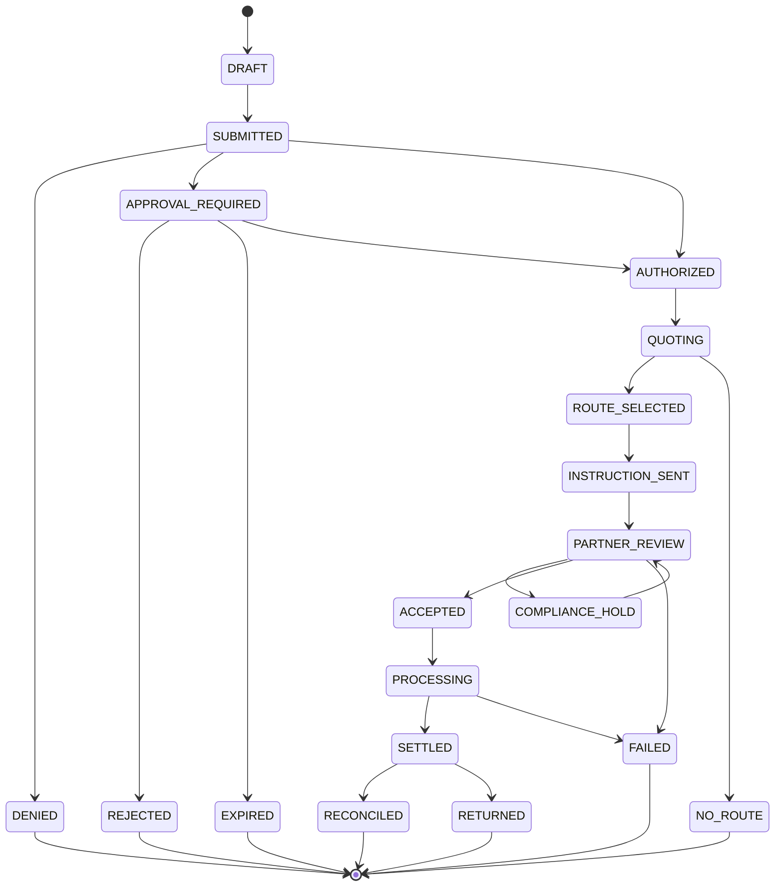

# Message Lifecycle and State Machine

## States



## Rules

- State transitions are append-only events.
- Every command is idempotent.
- `PaymentIntent` becomes immutable after submission except cancellation metadata.
- Any material change to amount, currency, source, beneficiary, purpose, or destination creates a new intent.
- Approvals bind to the canonical intent hash and policy version.
- An approval expires at the earliest of its own expiry, intent expiry, identity revocation, policy invalidation, or organization freeze.
- A partner acceptance does not equal final settlement.
- `SETTLED` requires partner or rail evidence.
- `RECONCILED` requires matching internal, partner, and settlement evidence within configured tolerance.

## Standard failure codes

- `IDENTITY_INVALID`
- `AUTHORITY_INSUFFICIENT`
- `POLICY_DENIED`
- `BUDGET_EXCEEDED`
- `APPROVAL_MISSING`
- `APPROVAL_EXPIRED`
- `BENEFICIARY_NOT_VERIFIED`
- `JURISDICTION_UNSUPPORTED`
- `NO_ELIGIBLE_PARTNER`
- `PARTNER_UNAVAILABLE`
- `COMPLIANCE_HOLD`
- `SETTLEMENT_REJECTED`
- `SETTLEMENT_TIMEOUT`
- `RECONCILIATION_MISMATCH`
- `DUPLICATE_REQUEST`
- `SIGNATURE_INVALID`

## Event envelope

```json
{
  "event_id": "evt_01J...",
  "event_type": "AIFP4.SettlementStatus",
  "protocol_version": "0.1",
  "aggregate_id": "pi_01J...",
  "sequence": 8,
  "occurred_at": "2026-07-27T12:00:00Z",
  "producer": "partner:ptn_example_eu_01",
  "data": {
    "status": "SETTLED",
    "partner_reference": "ref_123"
  },
  "signature": "base64url-signature"
}
```

Consumers must reject invalid signatures, stale timestamps outside the permitted window, duplicate event IDs, and sequence regressions.
