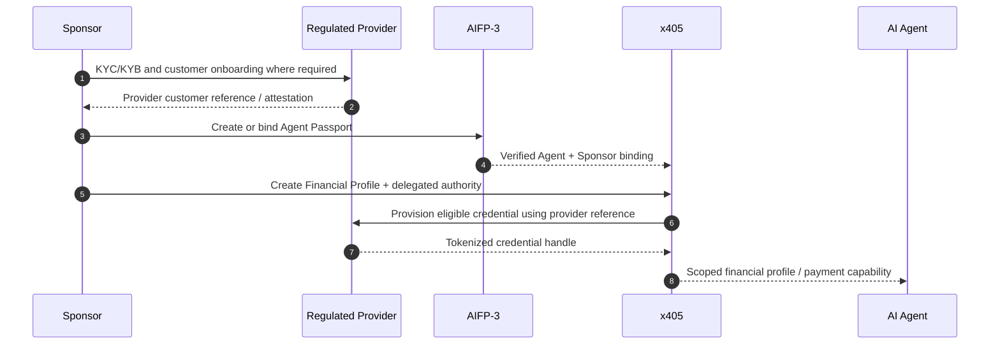

# x405 Onboarding and Delegated Authority

## 1. Objective

The onboarding model lets a verified person or organization create financial capability for one or more AI Agents without forcing each Agent to behave like a human bank customer.

## 2. Sponsor

The Sponsor is the party with legal or operational authority over the Agent.

Examples:

- an individual developer operating a personal Agent;
- a company operating internal Agents;
- an Agent Platform provisioning Agents for customers;
- a SaaS company giving customers autonomous purchasing Agents.

## 3. Onboarding sequence



## 4. Reusable onboarding

A provider MAY allow an existing verified Sponsor relationship to provision additional Agents without repeating the full initial onboarding flow every time.

That is a provider and jurisdiction decision, not a blanket x405 guarantee.

The protocol SHOULD support references such as:

```json
{
  "provider_id": "ptn_issuer_01",
  "subject_ref": "customer_token_abc",
  "subject_type": "ORGANIZATION",
  "status": "VERIFIED",
  "scope": ["CARD_ISSUING", "BANK_TRANSFER"],
  "issued_at": "2026-09-07T00:00:00Z",
  "expires_at": "2027-09-07T00:00:00Z"
}
```

## 5. Delegated authority example

```json
{
  "authority_id": "auth_agent_01",
  "agent_id": "agt_01",
  "profile_id": "afp_01",
  "allowed_rails": ["X402", "CARD", "STABLECOIN"],
  "allowed_currencies": ["USD", "EUR", "USDC"],
  "limits": {
    "per_transaction": "500.00",
    "daily": "2000.00",
    "monthly": "15000.00"
  },
  "merchant_controls": {
    "allow": ["AWS", "OPENAI", "APPROVED_API_PROVIDERS"],
    "block_categories": ["GAMBLING", "CASH_ADVANCE"]
  },
  "approval": {
    "above": "1000.00",
    "required_approvals": 1
  },
  "expires_at": "2027-01-01T00:00:00Z"
}
```

## 6. Credential provisioning

Credentials SHOULD be provisioned as scoped handles.

For a card this may be a network token or provider credential ID. For a bank account it may be a provider-side source-account token. For a wallet it may be a wallet reference governed by a non-custodial or managed signing policy.

The Agent should receive only what it needs to request permitted payments.

## 7. Continuous controls

Even when initial KYC/KYB is reusable, providers may continue to perform:

- sanctions and PEP screening;
- transaction monitoring;
- fraud monitoring;
- risk-score updates;
- re-verification;
- credential suspension;
- jurisdiction eligibility checks.

x405 MUST support profile and credential suspension without requiring the Agent's cooperation.

## 8. Revocation

Sponsor or provider revocation must propagate to the authorization layer before new execution is permitted.

An Agent MUST NOT be able to modify its own Sponsor binding, compliance attestation, or maximum delegated limits without an authorized external signer.
